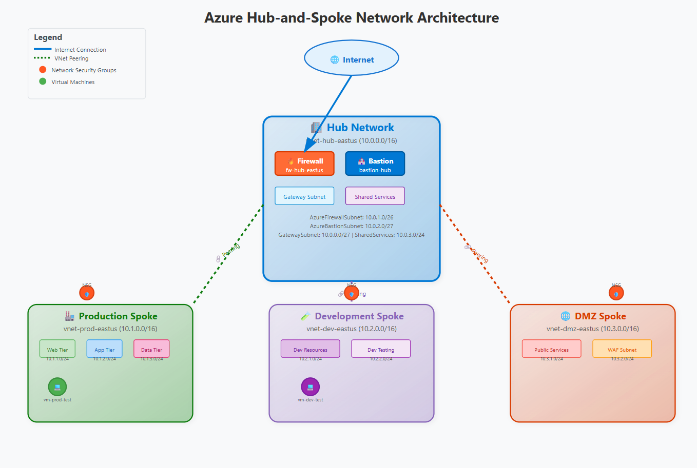

# Azure Hub-and-Spoke Network Architecture

[](https://portal.azure.com/#create/Microsoft.Template/uri/https%3A%2F%2Fraw.githubusercontent.com%2Fyungkolt%2Fazure-hub-spoke-network%2Fmain%2Fdeployment%2Farm-templates%2Fmain.json)
[](https://opensource.org/licenses/MIT)
[](https://azure.microsoft.com/)
[](https://www.terraform.io/)

## 🏗️ Architecture Overview

This repository contains a complete implementation of Microsoft Azure's recommended hub-and-spoke network architecture, designed for enterprise-scale deployments with security, scalability, and operational excellence in mind.



### 🎯 Key Features

- **🛡️ Enterprise Security**: Zero-trust network design with Azure Firewall and NSGs
- **📈 Scalable Architecture**: Modular spoke design for easy expansion
- **⚙️ Infrastructure as Code**: Multiple deployment options (ARM, Terraform, Scripts)
- **📊 Monitoring & Observability**: Comprehensive logging and alerting
- **💰 Cost Optimization**: Right-sized resources with cost monitoring
- **📚 Well-Documented**: Detailed documentation and runbooks

## 🚀 Quick Start

### Prerequisites
- Azure subscription with Contributor access
- Azure CLI installed and configured
- Bash shell (Linux/macOS/WSL)

### 🧪 Test Deployment (Recommended First Step)
```bash
# Clone the repository
git clone https://github.com/yungkolt/azure-hub-spoke-network.git
cd azure-hub-spoke-network

# Run a safe test deployment first
chmod +x test-deployment.sh
./test-deployment.sh
```

### 🚁 Full Production Deployment
```bash
# Make all scripts executable
chmod +x deployment/scripts/*.sh
chmod +x testing/*.sh

# Run the full deployment
cd deployment/scripts
./deploy.sh
```

**⏱️ Expected completion time: 30-45 minutes**

## 📋 What Gets Deployed

<details>
<summary><strong>🏢 Hub Network Components</strong></summary>

- **Virtual Network**: Central hub (10.0.0.0/16) with multiple subnets
- **Azure Firewall**: Centralized security and traffic control
- **Azure Bastion**: Secure VM access without public IPs
- **VPN Gateway Subnet**: Ready for hybrid connectivity
- **Shared Services**: Monitoring and management resources
</details>

<details>
<summary><strong>🌐 Spoke Networks</strong></summary>

- **Production Spoke** (10.1.0.0/16): Multi-tier application architecture
  - Web tier subnet (10.1.1.0/24)
  - Application tier subnet (10.1.2.0/24)
  - Data tier subnet (10.1.3.0/24)
- **Development Spoke** (10.2.0.0/16): Development and testing resources
- **DMZ Spoke** (10.3.0.0/16): Public-facing services and WAF
</details>

<details>
<summary><strong>🔒 Security & Monitoring</strong></summary>

- **Network Security Groups**: Micro-segmentation with allow/deny rules
- **Route Tables**: Custom routing through Azure Firewall
- **Log Analytics**: Centralized logging and analysis
- **NSG Flow Logs**: Network traffic analysis
- **Azure Firewall Logs**: Security event monitoring
- **Custom Alerts**: Automated monitoring and notifications
</details>

## 📁 Repository Structure

```
azure-hub-spoke-network/
├── 📄 README.md                          # This file
├── 📜 LICENSE                            # MIT License
├── 🚀 test-deployment.sh                 # Quick test deployment
├── 🗂️ deployment/
│   ├── 📜 scripts/                       # Bash deployment scripts
│   │   ├── deploy.sh                     # Main deployment orchestrator
│   │   ├── 01-deploy-hub.sh             # Hub network setup
│   │   ├── 02-deploy-spokes.sh          # Spoke networks setup
│   │   ├── 03-configure-peering.sh      # Network peering
│   │   ├── 04-deploy-security.sh        # Security components
│   │   ├── 05-configure-routing.sh      # Custom routing
│   │   ├── 06-deploy-monitoring.sh      # Monitoring setup
│   │   └── cleanup.sh                   # Resource cleanup
│   └── 📋 arm-templates/                 # ARM templates
│       └── main.json                    # Infrastructure template
├── 🧪 testing/
│   └── connectivity-tests.sh            # Network validation tests
├── 📊 monitoring/
│   ├── queries/
│   │   └── network-analytics.kql        # KQL queries for Log Analytics
│   ├── dashboards/
│   │   └── network-overview-dashboard.json  # Azure dashboard template
│   └── alerts/
│       └── network-alerts-config.sh     # Monitoring alerts setup
├── 📖 docs/
│   ├── architecture/
│   │   └── hub-spoke-diagram.svg        # Network architecture diagram
│   └── deployment/
│       └── step-by-step-guide.md        # Detailed deployment guide
└── ⚙️ .github/
    └── workflows/                       # CI/CD pipelines
        └── validate-templates.yml       # Template validation
```

## 🛡️ Security Features

- **🎯 Zero-Trust Architecture**: Default deny with explicit allow rules
- **🔒 Network Micro-Segmentation**: Subnet-level security controls
- **🔥 Centralized Firewall**: Azure Firewall for unified security policies
- **🏰 Bastion Access**: Secure administrative access without public IPs
- **📝 Comprehensive Logging**: All network traffic and security events logged
- **⚡ Real-time Monitoring**: Automated alerting for security incidents

## 📊 Monitoring & Observability

- **📈 Real-time Network Topology**: Visual network monitoring
- **⚠️ Performance Metrics**: Latency, throughput, and availability alerts
- **🔍 Security Event Monitoring**: Automated threat detection
- **💰 Cost Tracking**: Resource cost monitoring and optimization
- **📋 Compliance Reporting**: Automated security compliance checks

## 🔧 Customization Options

<details>
<summary><strong>🏢 Small Business Configuration</strong></summary>

- Single production spoke
- Azure Firewall Basic
- Minimal monitoring
- Cost-optimized sizing
</details>

<details>
<summary><strong>🏭 Enterprise Configuration</strong></summary>

- Multiple spokes per environment
- Azure Firewall Premium
- Advanced threat protection
- Comprehensive monitoring
</details>

<details>
<summary><strong>🌍 Multi-Region Setup</strong></summary>

- Hub networks in multiple regions
- Global VNet peering
- Traffic Manager integration
- Geo-redundant monitoring
</details>

<details>
<summary><strong>🔗 Hybrid Cloud Integration</strong></summary>

- ExpressRoute connectivity
- VPN gateway deployment
- On-premises network integration
- Hybrid DNS configuration
</details>

## 📖 Documentation

| Document | Description |
|----------|-------------|
| [🚀 Step-by-Step Guide](docs/deployment/step-by-step-guide.md) | Complete deployment walkthrough |
| [🏗️ Architecture Diagram](docs/architecture/hub-spoke-diagram.svg) | Visual network topology |
| [📊 KQL Queries](monitoring/queries/network-analytics.kql) | Log Analytics monitoring queries |
| [⚠️ Connectivity Tests](testing/connectivity-tests.sh) | Network validation scripts |

## 💰 Cost Estimates

| Resource | Daily Cost (USD) | Monthly Cost (USD) |
|----------|------------------|-------------------|
| Azure Firewall Standard | ~$30 | ~$900 |
| Azure Bastion Standard | ~$5 | ~$150 |
| VPN Gateway (if used) | ~$1 | ~$30 |
| Log Analytics | ~$2-5 | ~$60-150 |
| Virtual Networks | ~$0.50 | ~$15 |
| Test VMs (B1s) | ~$8 | ~$240 |
| **Total Estimate** | **~$46** | **~$1,380** |

💡 **Cost Optimization Tips**:
- Use test deployment for learning (saves ~70% cost)
- Enable VM auto-shutdown for development environments
- Use Azure Firewall Basic for non-production workloads

## 🧪 Testing and Validation

### Run Connectivity Tests
```bash
# Test the deployment
cd testing
./connectivity-tests.sh rg-hub-spoke-network
```

### Manual Validation Steps
1. **Network Topology**: Verify peering connections in Azure Portal
2. **Security Rules**: Test NSG rules and firewall policies
3. **Bastion Access**: Connect to VMs through Bastion
4. **Internet Access**: Verify traffic flows through firewall
5. **Monitoring**: Check Log Analytics for network data

## 🤝 Contributing

Contributions are welcome! Here's how you can help:

1. **🐛 Report Issues**: Found a bug? Open an issue
2. **💡 Suggest Features**: Have ideas? Start a discussion
3. **🔧 Submit PRs**: Improve the code or documentation
4. **📚 Update Docs**: Help keep documentation current

### Development Workflow
```bash
# Fork and clone
git clone https://github.com/yungkolt/azure-hub-spoke-network.git
cd azure-hub-spoke-network

# Create feature branch
git checkout -b feature/amazing-feature

# Make changes and test
./test-deployment.sh

# Commit and push
git commit -m "Add amazing feature"
git push origin feature/amazing-feature

# Create Pull Request
```

## 🆘 Getting Help

- **📚 Documentation**: Check the [docs folder](docs/) first
- **🐛 Issues**: Create a [GitHub issue](https://github.com/yungkolt/azure-hub-spoke-network/issues)
- **💬 Discussions**: Join [GitHub discussions](https://github.com/yungkolt/azure-hub-spoke-network/discussions)
- **📞 Azure Support**: For Azure-specific issues

## 📄 License

This project is licensed under the MIT License - see the [LICENSE](LICENSE) file for details.

## 🔗 Additional Resources

- [Azure Well-Architected Framework](https://docs.microsoft.com/en-us/azure/architecture/framework/)
- [Azure Network Security Best Practices](https://docs.microsoft.com/en-us/azure/security/fundamentals/network-best-practices)
- [Hub-spoke network topology in Azure](https://docs.microsoft.com/en-us/azure/architecture/reference-architectures/hybrid-networking/hub-spoke)

---

## 🎯 Project Goals & Learning Outcomes

This project demonstrates:
- ✅ **Enterprise Network Design**: Hub-spoke architecture patterns
- ✅ **Azure Security**: Firewall, NSGs, Bastion, and Zero Trust principles
- ✅ **Infrastructure as Code**: Automated deployment and configuration
- ✅ **DevOps Practices**: CI/CD pipelines, testing, and validation
- ✅ **Cloud Monitoring**: Logging, alerting, and observability
- ✅ **Cost Management**: Resource optimization and financial governance
- ✅ **Documentation**: Professional technical documentation

**Perfect for**: Cloud engineers, network architects, DevOps engineers, and anyone learning Azure networking!

---

⭐ **If this project helped you learn Azure networking, please give it a star!** ⭐

**Built with ❤️ by [yungkolt](https://github.com/yungkolt)**
